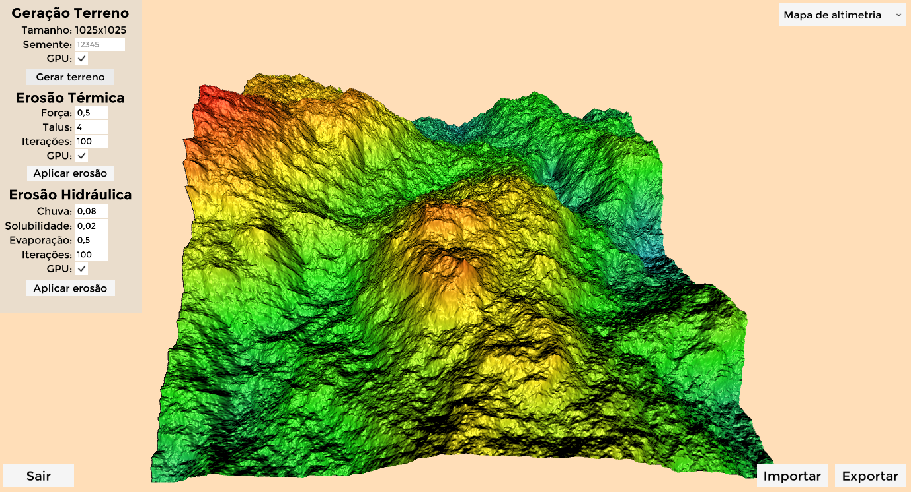
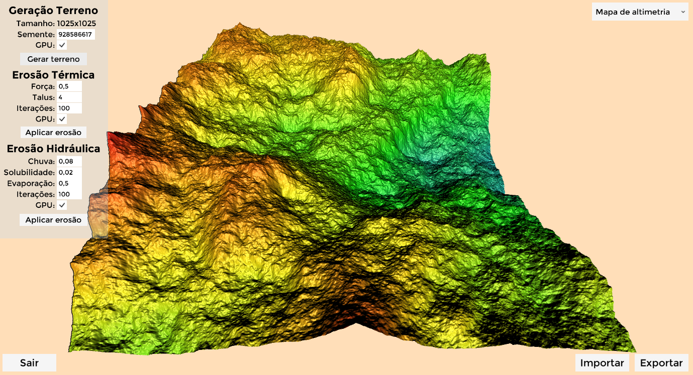
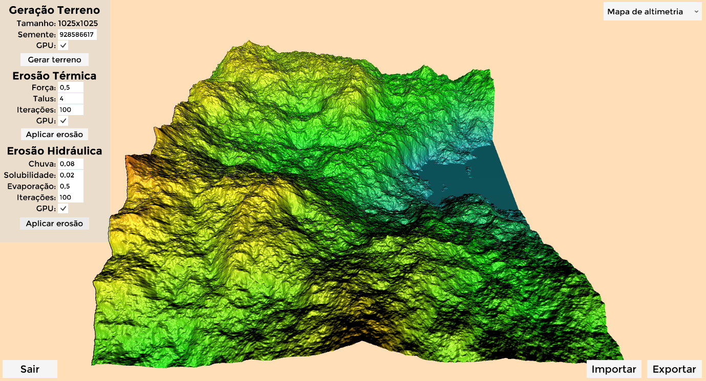
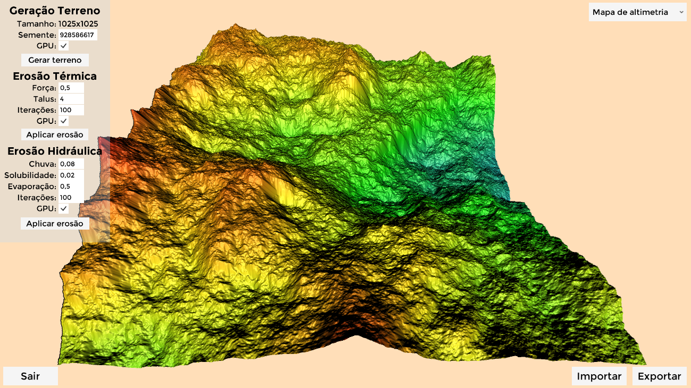
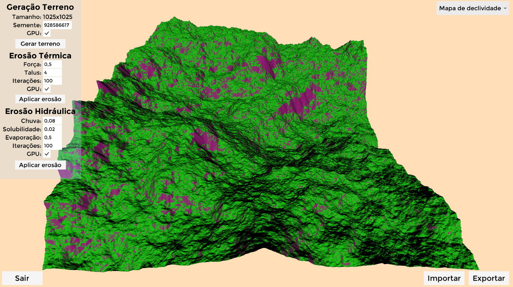
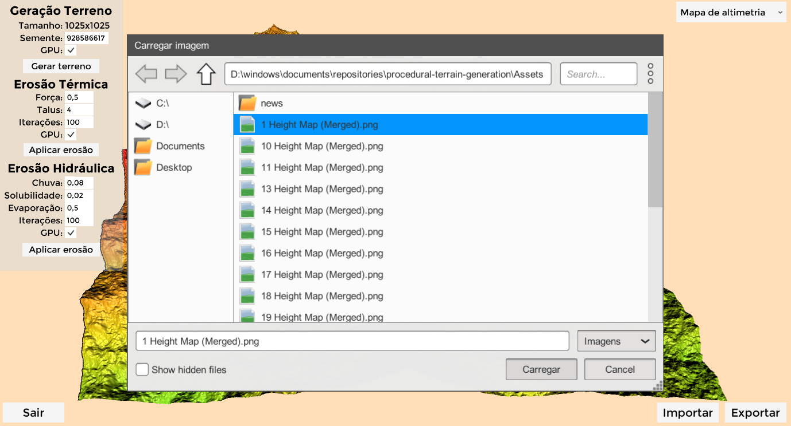
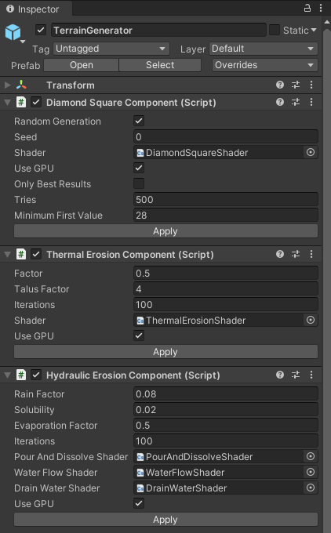

# Geração procedural de terrenos com aparência natural.

Este repositório disponibiliza uma ferramenta para geração procedural de terrenos com aparência natural desenvolvida na plataforma [Unity](https://unity.com/). A ferramenta pode ser utilizada através de um [executável para Windows 10](https://github.com/AlexSerodio/procedural-terrain-generation/releases/tag/v0.1.0-windows) e um [*plugin*](https://github.com/AlexSerodio/procedural-terrain-generation/releases/tag/v0.1.0-unitypackage) para a Unity.

  

## Funcionamento

A geração do terreno pode ser feita através de três operações disponibilizadas pelo menu esquerdo.
Primeiro deve-se gerar o terreno base através do botão **`Gerar terreno`**. Em seguida o terreno base pode ser melhorado com o algoritmo de erosão térmica e erosão hidráulica através dos botões **`Aplicar erosão`**. As imagens abaixo demonstram um terreno gerado e melhorado pela erosão térmica e hidráulica, respectivamente.

  
  
  

Por padrão o terreno é texturizado por um mapa de altimetria no qual as regiões mais elevadas são coloridas de vermelho, decaindo para amarelo, verde e azul para as regiões mais baixas. Porém o mapa de altimetria pode ser substituído por um mapa de declividade através do *dropdown* no canto superior direito. O mapa de declividade colore as partes mais íngremes do terreno de roxo e o restante de verde, como visto nas imagens abaixo que mostram um mesmo terreno mapeado pelos dois mapas.

  
  

Além disso, também é possível exportar um terreno gerado pela ferramenta ou importar um terreno gerado externamente por outras ferramentas como por exemplo o [terrain.party](terrain.party). Tanto a importação como a exportação utilizam imagens no padrão de [heightmap](https://pt.wikipedia.org/wiki/Mapa_de_altura).

  

Tratando-se do *plugin* para a Unity, todas as funcionalidades são as mesmas, porém são acessíveis a partir dos *scripts* contidos no *prefab* `TerrainGenerator`

  

A tabela abaixo apresenta cada um dos parâmetros modificáveis pelo menu do executável ou scripts do *plugin*. Porém destaca-se que tanto o executável como o *plugin* possuem explicações sobre cada um dos campos no formato de *tooltips* que aparecem ao posicionar o mouse em cima de cada campo.

|  Funcionalidades  	|  Parâmetros 	|                                                             Utilidade                                                            	|
|:-----------------:	|:-----------:	|:--------------------------------------------------------------------------------------------------------------------------------:	|
|   Gerar terreno   	|   Semente   	|          Utilizado como base para a função geradora de números aleatórios. A mesma semente sempre gerará o mesmo terreno         	|
|   Erosão térmica  	|     Força    	|                Controla a quantidade de sedimento que será movimentado. Recomenda-se manter um valor próximo a 0,5               	|
|   Erosão térmica  	|    Talus    	| Controla a partir de qual inclinação o terreno sofrerá os efeitos da erosão. Quanto maior o valor, maior a inclinação necessária 	|
|   Erosão térmica  	|   Iterações 	|                   Quantidade de repetições da operação. Valores maiores que 100 não apresentam grandes mudanças                  	|
| Erosão hidráulica 	|     Chuva    	|         Controla a quantidade de chuva sobre o terreno. Quanto maior, \nmais água será derramada na superfície do terreno        	|
| Erosão hidráulica 	| Solubilidade 	|     Controla o fator de solubilidade da superfície. Quanto maior, \nmais sedimentos serão desprendidos e carregados pela água    	|
| Erosão hidráulica 	|  Evaporação 	|   Controla o fator de evaporação da água da chuva. Quanto maior, maior a quantidade de água evaporada ao final de cada iteração   |
| Erosão hidráulica 	|   Iterações 	|                   Quantidade de repetições da operação. Valores maiores que 100 não apresentam grandes mudanças                  	|

